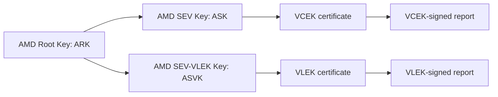

# AMD SEV-SNP Attestation Details

The purpose of this document is to explain AMD SEV-SNP attestation and how
its attestation scheme is supported in Veraison.

## Introduction

Secure Encrypted Virtualization with Secure Nested Paging (SEV-SNP) protects
virtual machines from a privileged host through memory encryption and integrity
protections. Remote attestation lets a verifier examine a signed statement
about a guest's initial measurement, configuration, and platform security
version. See [AMD's SEV overview][amd-sev] for the architectural background.

A relying party needs both an authentic report and an acceptable guest state.
A valid signature establishes the origin and integrity of the reported data;
reference values and appraisal policy determine whether that data is suitable
for the relying party's use case.

## SEV-SNP Concepts

### Glossary

* **AMD Secure Processor (AMD-SP)**: the processor running the firmware that
  manages SNP guest security and produces attestation reports.
* **VMM**: the virtual machine manager or hypervisor hosting the guest.
* **VMPL**: Virtual Machine Privilege Level, identifying a privilege level
  within the SNP guest.
* **TCB**: Trusted Computing Base. The report carries several versions of the
  platform TCB, distinct from the guest software version.
* **SVN / SPL**: Security Version Number / Security Patch Level, used to express
  security update levels of individual components.
* **ARK**: AMD Root Key, the root of the endorsement certificate hierarchy.
* **ASK**: AMD SEV Key, the intermediate key certifying VCEKs.
* **VCEK**: Versioned Chip Endorsement Key, derived from a chip-specific secret
  and a TCB version, and used to sign reports.
* **VLEK**: Versioned Loaded Endorsement Key, an alternative report-signing key
  derived through AMD's KDS and provisioned by a cloud service provider.
* **ASVK**: AMD SEV-VLEK Key, the intermediate key certifying VLEKs.
* **KDS**: AMD's Key Distribution Service, which supplies endorsement
  certificates and certificate-chain information.

The [firmware ABI][amd-abi], [VCEK/KDS specification][amd-kds], and
[`go-sev-guest` verification code][guest-verify] describe these mechanisms.

### Guest Measurements and Identity

`MEASUREMENT` is the guest's SHA-384 launch digest. It identifies the initial
measured guest state. It is not a digest of everything that the guest might
load or execute later. A deployment must establish which firmware, pages, and
configuration contribute to its launch measurement before treating that digest
as an identity for its workload.

`FAMILY_ID`, `IMAGE_ID`, and `GUEST_SVN` provide guest identity and version
information. `ID_KEY_DIGEST` and `AUTHOR_KEY_DIGEST` can identify keys associated
with the guest's identity block. `HOST_DATA` is supplied by the host; a signed
copy authenticates the reported bytes without making the host's choice of
those bytes trustworthy by itself.

`REPORT_DATA` is a separate, 64-byte guest-supplied field. In this Veraison
implementation it contains the session nonce and binds the report to a
particular challenge. These fields are decoded by [`go-sev-guest`][guest-abi]
and mapped into CoMID measurements by [`go-gen-ref`][report-to-comid].

## Attestation Report and Signing

### Report Structure

The raw report consumed by the pinned [`go-sev-guest` ABI parser][guest-abi]
is 1,184 bytes (`0x4a0`). Its signature covers the first 672 bytes (`0x2a0`);
the remaining 512 bytes hold the ABI signature structure, including padding.
The report uses ECDSA P-384 with SHA-384. The certificate chain is transported
separately from the raw report.

The following are selected fields relevant to this implementation, not a
complete ABI layout. Integer fields in the raw report use little-endian
encoding; the CoMID representation is a separate encoding.

| Field | Size (bytes) | Role |
| --- | --- | --- |
| `VERSION` | 4 | Report format version |
| `GUEST_SVN` | 4 | Guest security version |
| `POLICY` | 8 | Guest policy bits |
| `FAMILY_ID`, `IMAGE_ID` | 16 each | Guest identity fields |
| `VMPL` | 4 | Privilege level associated with the report |
| `SIGNATURE_ALGO` | 4 | Report signature algorithm |
| `CURRENT_TCB` | 8 | Current platform TCB version |
| `PLATFORM_INFO` | 8 | Platform configuration flags |
| Signer information | 4 | Signing-key selection and related flags |
| `REPORT_DATA` | 64 | Guest-supplied challenge data |
| `MEASUREMENT` | 48 | SHA-384 launch digest |
| `HOST_DATA` | 32 | Host-supplied data |
| `ID_KEY_DIGEST`, `AUTHOR_KEY_DIGEST` | 48 each | Guest identity-key digests |
| `REPORT_ID`, `REPORT_ID_MA` | 32 each | Guest and migration-agent report identifiers |
| `REPORTED_TCB` | 8 | TCB version associated with the endorsement key |
| `CHIP_ID` | 64 | Hardware identifier, subject to masking |
| `COMMITTED_TCB`, `LAUNCH_TCB` | 8 each | Committed and launch-time TCB versions |
| `SIGNATURE` | 512 | Signature structure and padding |

Report versions may add fields within this layout. For example, the pinned
converter emits CPU family/model/stepping measurements for version 3 and later.
Parser support for a report version does not imply that every field is exposed
to Veraison's appraisal policy.

### Endorsement Certificate Chains

The two report-signing paths have different intermediate certificates:



The VCEK certificate binds its public key to a hardware identity and TCB
components. For VLEK, the cloud provider provisions key material through AMD's
VLEK mechanism. The report's signing-key selector determines which leaf
certificate to use. The verifier must establish trust independently of the
certificates supplied with the report. See the [KDS specification][amd-kds]
and [`go-sev-guest` certificate verification][guest-verify].

Veraison's integrity checker has branches for both signing keys. Its
certificate-chain representation uses the `AskCert` slot for the intermediate
certificate, including ASVK on the VLEK path. There is a separate VLEK claim
conversion limitation in the pinned dependency, described below.

## Evidence Transport in Veraison

The [`SEVSNP` scheme descriptor][scheme] advertises three evidence media types:

| Media type | Expected payload |
| --- | --- |
| `application/vnd.veraison.tsm-report+cbor` | CBOR-encoded TSM report |
| `application/vnd.veraison.tsm-report+json` | JSON-encoded TSM report |
| `application/eat+cwt; eat_profile="tag:github.com,2025:veraison/ratsd/cmw"` | The implementation's RATSd wrapper containing a CMW collection |

For the RATSd media type, `parseEvidence` actually expects a JSON object with a
`cmw` string. It decodes that string using standard Base64, parses the decoded
CMW JSON, and selects the `tsm-report` item. That item's media type must be
`application/vnd.veraison.tsm-report+json`. The advertised media type should
therefore not be taken as support for arbitrary CBOR Web Tokens.

All three paths produce a TSM report containing:

* `outblob`: the binary SNP attestation report.
* `auxblob`: a certificate table carrying ARK, the appropriate intermediate,
  and a VCEK or VLEK certificate. The table is required by this scheme.

The scheme's `readCert` helper expects PEM certificates in that table and
converts them to DER for the verification library. A bare SNP report, or a
certificate table containing DER certificates only, does not satisfy this
implementation's input contract. The services repository includes
[evidence fixtures and a submission script][evidence-fixtures].

## Trust Anchors and Reference Values

### Provisioning Profiles

The scheme registers two CoRIM profiles in [`corim.go`][corim]:

* `tag:amd.com,2024:snp-corim-profile`
* `https://amd.com/ark`

The [scheme wrapper][wrapper] advertises `application/rim+cbor` and
`application/rim+cose`, each with the appropriate `profile` parameter, for
provisioning. For example, the supplied endorsement submission script uses:

```text
application/rim+cbor; profile="tag:amd.com,2024:snp-corim-profile"
```

The similarly named `application/corim-unsigned+cbor` constant in `scheme.go`
is used when constructing extracted claims; it is not the provisioning media
type advertised by the wrapper. Provisioning uses the existing
[Endorsement Provisioning API](../api/endorsement-provisioning/README.md).

### Trust Anchor Selection

`GetTrustAnchorIDs` reads the supplied ARK certificate and constructs a CoMID
environment from its subject organization and common name. The supplied Genoa
fixture selects:

```json
{
  "class": {
    "vendor": "Advanced Micro Devices",
    "model": "ARK-Genoa"
  }
}
```

These names select a provisioned record; they do not establish trust. During
integrity verification the supplied ARK bytes must match the provisioned
certificate bytes exactly, including their PEM representation. The provisioned
key must be a single `pkix-base64-cert` at this stage, even though the profile's
validation also permits certificate-path values.

`go-sev-guest` then verifies the certificate chain using its AMD root checks.
The scheme does not set `TrustedRoots` to replace the library's roots with an
arbitrary provisioned CA. The [trust-anchor fixture][ta-fixture] illustrates the
CoMID `attester-verification-keys` triple used here.

### Reference Value Selection

`ExtractClaims` decodes the report, converts it to a CoMID, and wraps it in an
unsigned CoRIM-shaped claims map. This is an internal representation of
evidence; it does not make the evidence an independently trusted endorsement.

`GetReferenceValueIDs` combines the converted environment's class OID with the
launch digest from measurement key `641`. The latter becomes the lookup
environment's byte-string `instance`. In the VCEK fixture this is:

```json
{
  "class": {
    "id": {
      "type": "oid",
      "value": "1.3.6.1.4.1.3704.3.1"
    }
  },
  "instance": {
    "type": "bytes",
    "value": "dpnmrBLM39HfrHDmSc4fBGyyr7sANDj0zd3+LMvhgvpf++jc25MEVDJOEMUseImA"
  }
}
```

This example is taken from the [reference-value fixture][rv-fixture]. Its
`instance` identifies a launch measurement, not a unique running VM or a chip.
Guests sharing that measurement can select the same reference values.

The profile requires an OID class ID, a byte-string instance, and unsigned
integer measurement keys. Expected guest measurements and minimum TCB values
must come from a trusted release or provisioning process. Copying a newly
received report into the reference store would remove that independent basis
for appraisal.

## Report Verification in Veraison

### Evidence Integrity and Freshness

The [`ValidateEvidenceIntegrity` implementation][scheme] performs these steps:

1. Obtain the single provisioned ARK certificate.
2. Parse the evidence wrapper and certificate table, requiring ARK, an
   intermediate certificate, and at least one endorsement-key certificate.
3. Compare the supplied ARK bytes with the provisioned ARK bytes.
4. Compare the report's entire `REPORT_DATA` field with the session nonce.
5. Decode the report's signer information and require the selected VCEK or
   VLEK certificate. Reject unsupported signing-key selectors.
6. Pass the report and certificate chain to `verify.SnpAttestation`, which
   validates the certificate chain and report signature.

The nonce comparison is exact: there is no hashing, truncation, or padding.
For the [Challenge-Response API](../api/challenge-response/README.md), request
a 64-byte challenge:

```text
POST /challenge-response/v1/newSession?nonceSize=64
```

The guest must place those decoded nonce bytes in `REPORT_DATA` before
requesting its report. A shorter session nonce padded to 64 bytes only in the
report will fail comparison. The fixed nonces in test fixtures are useful for
replaying tests, not for establishing freshness in a live deployment.

The verification options set `DisableCertFetching: true` and
`CheckRevocations: false`. All certificates must therefore accompany the
evidence, and a successful verification does not establish that they are
unrevoked. Certificate time checks use the verifier's current time. The source
comments identify AMD KDS rate limits as the reason for disabling online work.

### Comparing Reference Values

`AppraiseClaims` tries the retrieved reference-value triples in turn and
accepts the first matching triple. Within a triple, the matcher iterates over
the reference measurements; it does not require every evidence measurement
to have a reference. The following summarizes [`tryMatchEvidence`][scheme]
and the [report-to-CoMID mapping][report-to-comid].

| CoMID key | Report field | Built-in appraisal behavior |
| --- | --- | --- |
| `0` | `VERSION` | Requires presence if referenced; version values are not compared |
| `1` | `GUEST_SVN` | Uses the generic SVN comparison; the converter emits `min-value` |
| `2` | `POLICY` | Skipped |
| `3`, `4`, `5` | `FAMILY_ID`, `IMAGE_ID`, `VMPL` | Compares raw bytes if referenced |
| `6`, `7` | `CURRENT_TCB`, `PLATFORM_INFO` | Skipped |
| `640` | `REPORT_DATA` | Skipped here; checked against the nonce during integrity verification |
| `641` | `MEASUREMENT` | Compares digests if referenced; also used for reference lookup |
| `642`, `643`, `644` | `HOST_DATA`, `ID_KEY_DIGEST`, `AUTHOR_KEY_DIGEST` | Compares raw bytes if referenced and present |
| `645`, `646` | `REPORT_ID`, `REPORT_ID_MA` | Skipped |
| `647` | `REPORTED_TCB` | Requires each compared TCB component to meet the reference minimum |
| `648`, `649`, `650` | CPU family, model, stepping | Compares raw bytes if referenced; emitted for report version 3 and later |
| `3328`, `3329` | `CHIP_ID`, `COMMITTED_TCB` | Skipped |
| `3330`, `3936` | Current and committed firmware versions | Skipped |
| `3968` | `LAUNCH_TCB` | Requires presence if referenced; compares the reference against evidence `REPORTED_TCB`, logging a shortfall without failing |

For `REPORTED_TCB`, the matcher decomposes the packed value into bootloader,
TEE, SNP firmware, and microcode SPLs. Each evidence component must be at least
the corresponding reference component. Comparing the packed integer alone
would not express that rule. This special comparison applies even when the
reference encodes its TCB as an `exact-value` SVN.

The generic comparator handles raw bytes, digests, and SVN values. It falls
through successfully for other value kinds, including `version`. Its SVN
behavior also depends on the encoded types: two `min-value` SVNs are compared
for equality. In particular, the converter's `GUEST_SVN` representation should
not be assumed to implement a guest-version lower-bound check.

### Attestation Results

The result uses the [EAR format](../datamodels/attestation-results/README.md)
and contains a `SEVSNP` submodule. The scheme initializes `hardware` to
`UnsafeHardwareClaim` and `runtime-opaque` to `VisibleMemoryRuntimeClaim`.
A matching reference triple changes them to `GenuineHardwareClaim` and
`EncryptedMemoryRuntimeClaim`. It then derives status from the trust vector
and attaches the converted claims as annotated evidence.

The [scheme tests][scheme-tests] assert an affirming result for the supplied
matching fixture and rejection of an incorrect nonce. An affirming appraisal
has the scope of the implemented checks; it does not imply that skipped policy
fields, runtime software, or certificate revocation have been evaluated.

## TCB Lifecycle

The [AMD firmware ABI][amd-abi] distinguishes the currently running TCB,
the committed TCB, the TCB reported for endorsement-key purposes, and the
committed TCB recorded when a guest was launched or imported. Updating platform
firmware does not by itself prove that an existing guest was launched under
the new TCB.

Operationally, a TCB update can require refreshed endorsement certificates
and revised reference minima. A guest-image update can change the launch
measurement and therefore the reference-value lookup key. Keep those two
update processes distinct when provisioning new reference triples.

The [KDS specification][amd-kds] describes retrieval of product certificate
chains, VCEKs for specific hardware/TCB combinations, and CRLs. Those retrieval
and refresh operations must be arranged outside the current scheme's
verification call. Its non-fatal handling of `LAUNCH_TCB` also means that a
requirement to reject guests launched under an older TCB needs additional
enforcement.

## Implementation Boundaries and Open Questions

* **VLEK conversion:** the integrity checker decodes the signing-key bits, but
  the pinned [`ReportToComid` implementation][report-to-comid] switches on the
  whole signer-information word and only accepts `0` and `1`. The
  [ABI helper][guest-abi] places the key selector in bits 4:2; a VLEK selector
  of `1` therefore produces a raw value of at least `4`. Such a report fails
  claim conversion in this revision. Raw value `1` instead sets the author-key
  flag on a VCEK report, yet the converter maps it to the CSP class OID
  `1.3.6.1.4.1.3704.3.2`. The VLEK integrity branch alone is not end-to-end
  VLEK support.
* **Policy coverage:** `POLICY` and `PLATFORM_INFO` are extracted but skipped
  by the matcher. Requirements about debugging, migration, SMT, or other
  reported flags need explicit appraisal policy. The converter also omits
  some zero-valued fields and does not expose all newer report fields.
* **TCB coverage:** reported-TCB comparison uses four SPL components.
  Support for other product-specific TCB layouts requires checking both the
  pinned library and the matcher. Launch-TCB shortfalls do not fail appraisal.
* **Certificate/report consistency:** the scheme calls the library's
  `verify.SnpAttestation`, not its separate `validate` policy API. Additional
  checks supplied by that API must not be assumed to run here.
* **Reference completeness:** profile validation checks measurement-key types,
  but does not require a particular set of measurements. Reference authors
  must include every constraint they intend the matcher to enforce, while
  accounting for the skipped and unsupported comparisons above.
* **Revocation:** the current verification path disables CRL checks. A design
  requiring revocation enforcement needs a certificate/CRL refresh and
  validation mechanism beyond this implementation.

## References

* [Intel TDX attestation musing, parent PR #41](https://github.com/veraison/docs/pull/41)
* [AMD SEV overview and specifications][amd-sev]
* [SEV Secure Nested Paging Firmware ABI Specification, publication 56860][amd-abi]
* [VCEK Certificate and KDS Interface Specification, publication 57230][amd-kds]
* [Veraison services source revision used for this document][services]
* [SEVSNP scheme implementation][scheme] and [CoRIM profile validation][corim]
* [SEVSNP tests][scheme-tests], [endorsement fixtures][endorsement-fixtures],
  and [evidence fixtures][evidence-fixtures]
* [Pinned report-to-CoMID conversion][report-to-comid]
* [Pinned `go-sev-guest` ABI][guest-abi] and [verification implementation][guest-verify]

[amd-sev]: https://www.amd.com/en/developer/sev.html
[amd-abi]: https://docs.amd.com/v/u/en-US/56860_PUB_SEV_SNP
[amd-kds]: https://docs.amd.com/v/u/en-US/57230
[services]: https://github.com/veraison/services/tree/9feadfecdab84c4e9c2d8d35eb77009991e7f99c
[scheme]: https://github.com/veraison/services/blob/9feadfecdab84c4e9c2d8d35eb77009991e7f99c/scheme/sevsnp/scheme.go
[corim]: https://github.com/veraison/services/blob/9feadfecdab84c4e9c2d8d35eb77009991e7f99c/scheme/sevsnp/corim.go
[wrapper]: https://github.com/veraison/services/blob/9feadfecdab84c4e9c2d8d35eb77009991e7f99c/handler/schemeimplementationwrapper.go
[scheme-tests]: https://github.com/veraison/services/blob/9feadfecdab84c4e9c2d8d35eb77009991e7f99c/scheme/sevsnp/scheme_test.go
[endorsement-fixtures]: https://github.com/veraison/services/tree/9feadfecdab84c4e9c2d8d35eb77009991e7f99c/scheme/sevsnp/test/corim
[ta-fixture]: https://github.com/veraison/services/blob/9feadfecdab84c4e9c2d8d35eb77009991e7f99c/scheme/sevsnp/test/corim/src/comid-sevsnp-ta.json
[rv-fixture]: https://github.com/veraison/services/blob/9feadfecdab84c4e9c2d8d35eb77009991e7f99c/scheme/sevsnp/test/corim/src/comid-sevsnp-refval.json
[evidence-fixtures]: https://github.com/veraison/services/tree/9feadfecdab84c4e9c2d8d35eb77009991e7f99c/scheme/sevsnp/test/evidence
[report-to-comid]: https://github.com/jraman567/go-gen-ref/blob/42d976f86e46/cmd/sevsnp/parser.go
[guest-abi]: https://github.com/google/go-sev-guest/blob/af1c107a648f/abi/abi.go
[guest-verify]: https://github.com/google/go-sev-guest/blob/af1c107a648f/verify/verify.go
